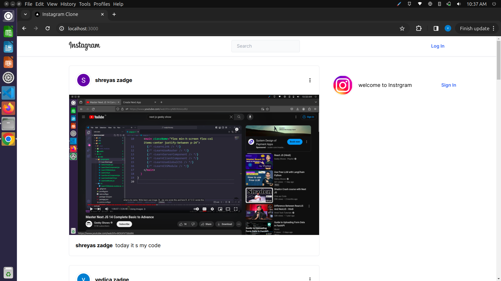
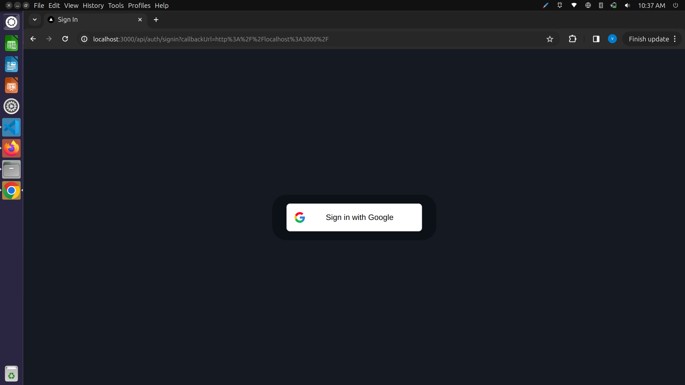
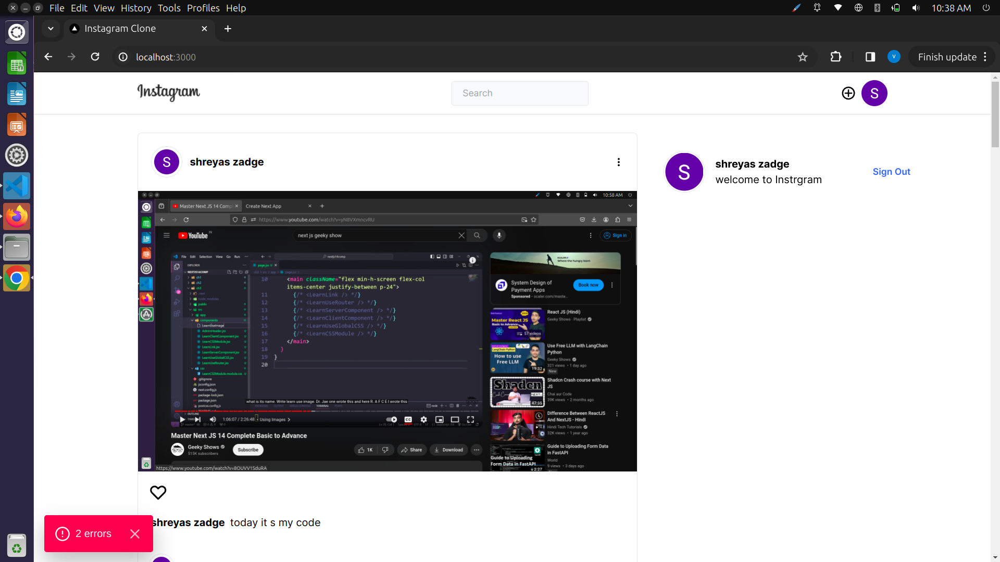
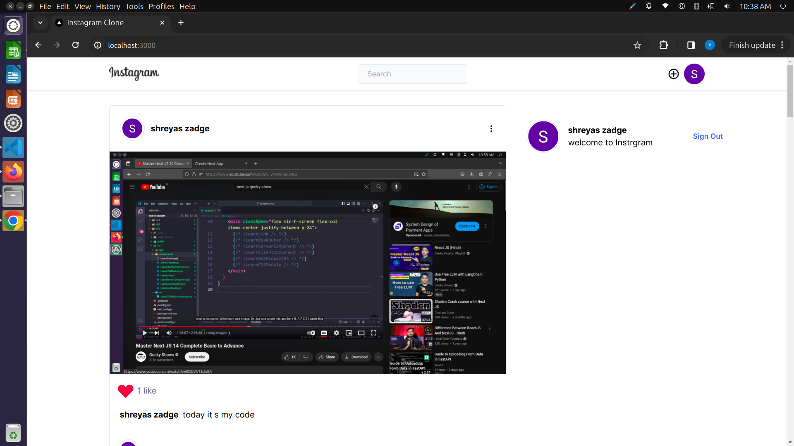
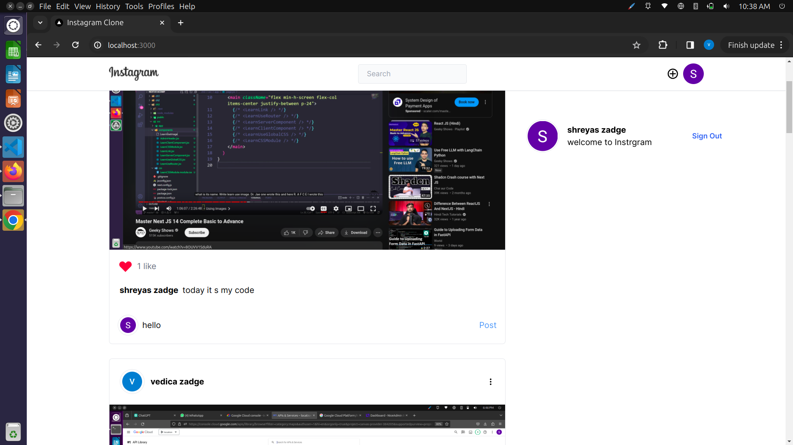
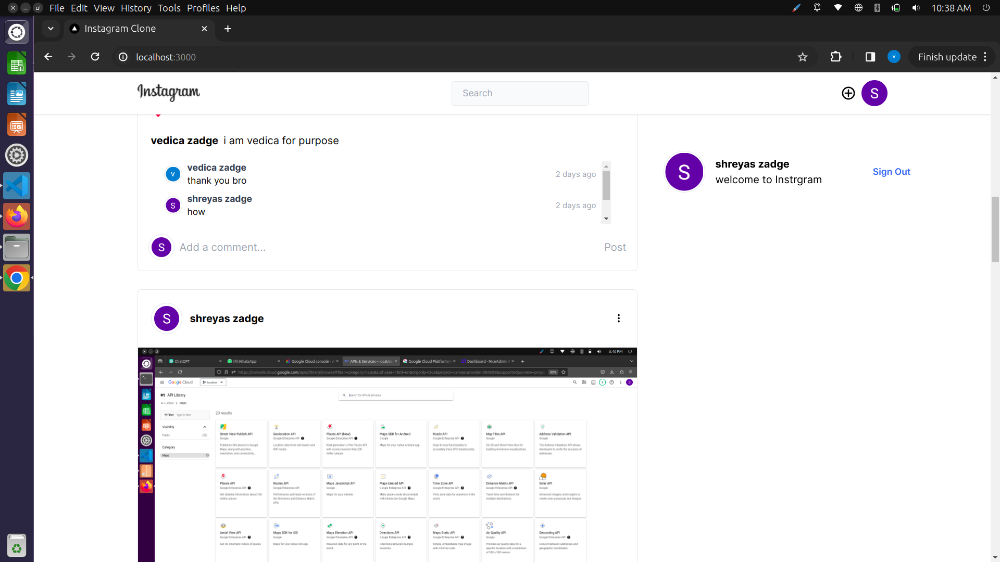
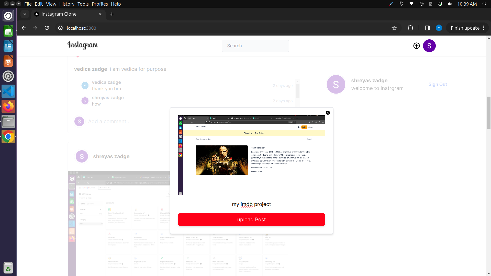

# Instagram Clone Project

This is a clone of the popular social media platform Instagram, built using [Next.js](https://nextjs.org/), [React.js](https://reactjs.org/), and [Firebase](https://firebase.google.com/).

## Description

This project aims to replicate the core functionality and design of the Instagram platform. It includes features such as creating user accounts, posting photos, liking and commenting on posts, following other users, and more.

## Features

- User authentication and authorization
- Posting photos with captions
- Liking and commenting on posts
- Following and unfollowing other users
- Explore page to discover new content
- Responsive design for seamless usage across different devices

## Screenshots










## Technologies Used

- Next.js
- React.js
- Firebase Authentication (for user authentication)
- Firebase Firestore (for database storage)
- Firebase Storage (for storing user-uploaded images)
- CSS (or SCSS, if applicable)

## Getting Started

To get a local copy up and running follow these simple steps:

 Clone the repository:
   ```sh
   git clone https://github.com/shreyaszadge/instagram_clone_project.git

